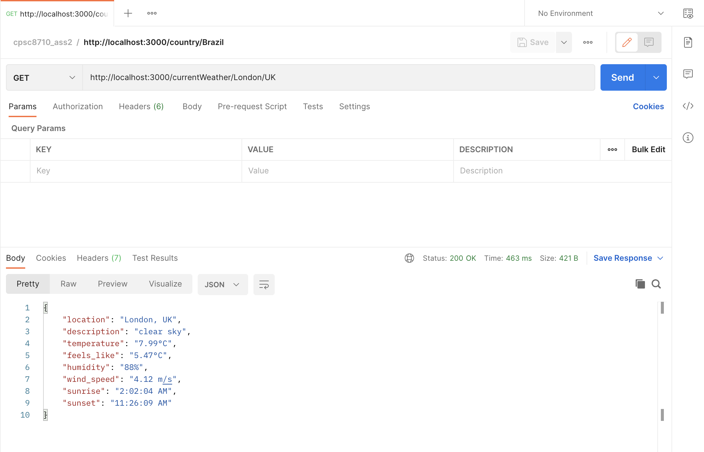
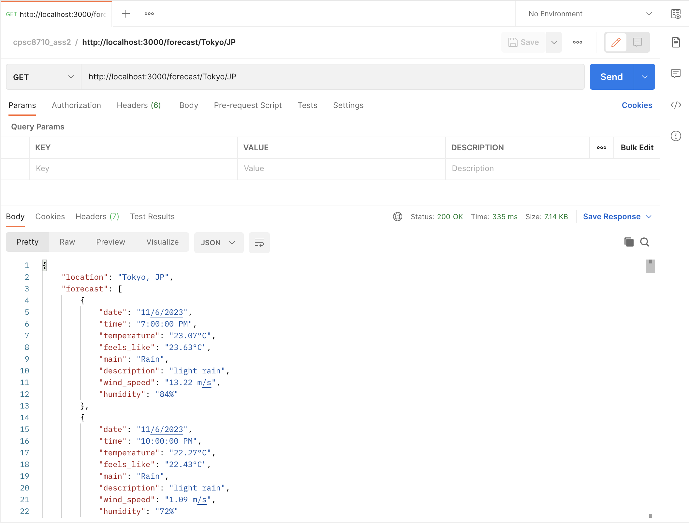
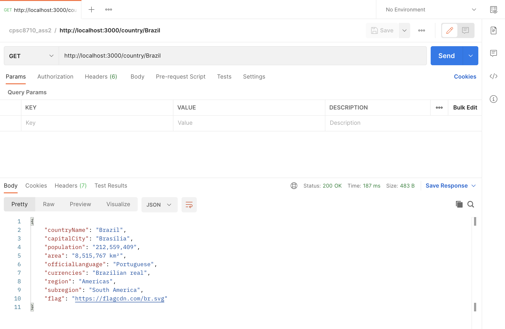
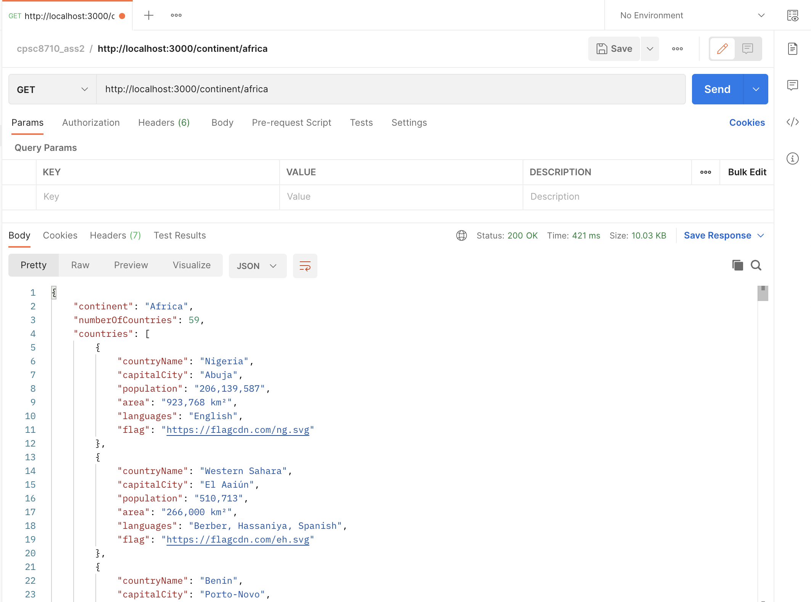
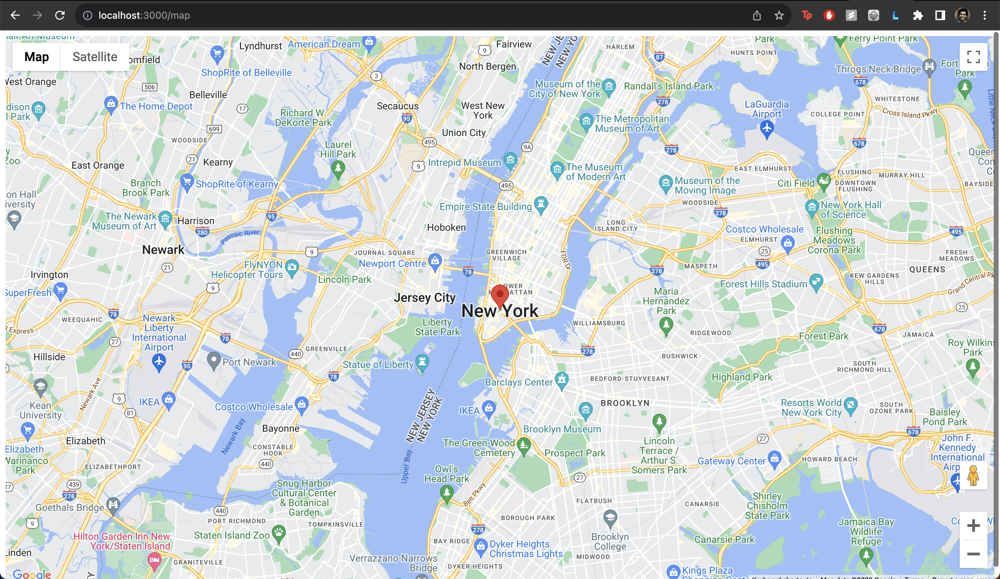
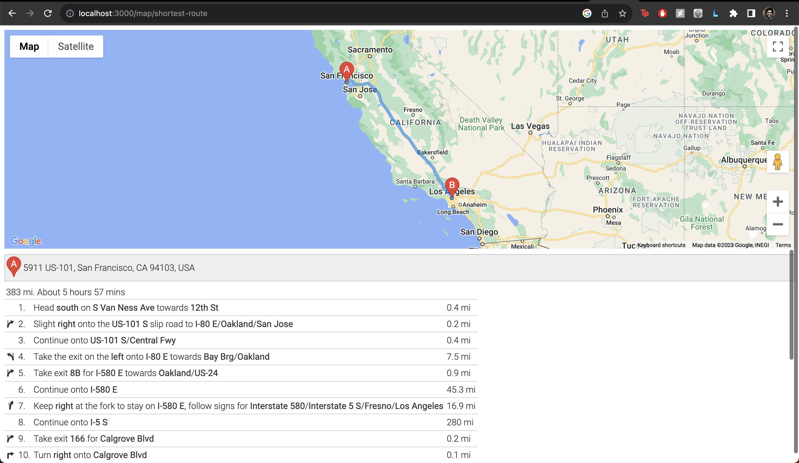
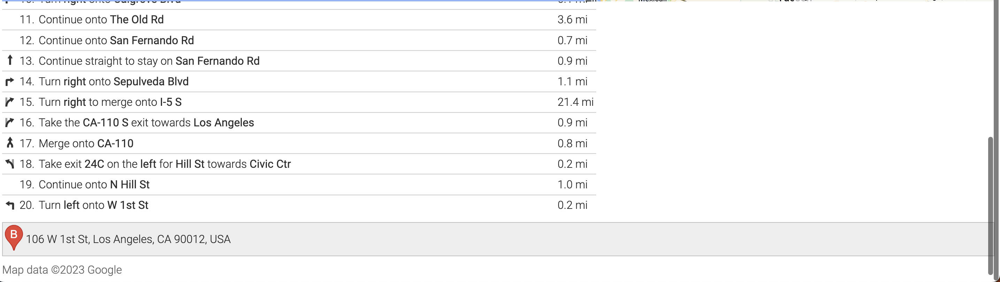
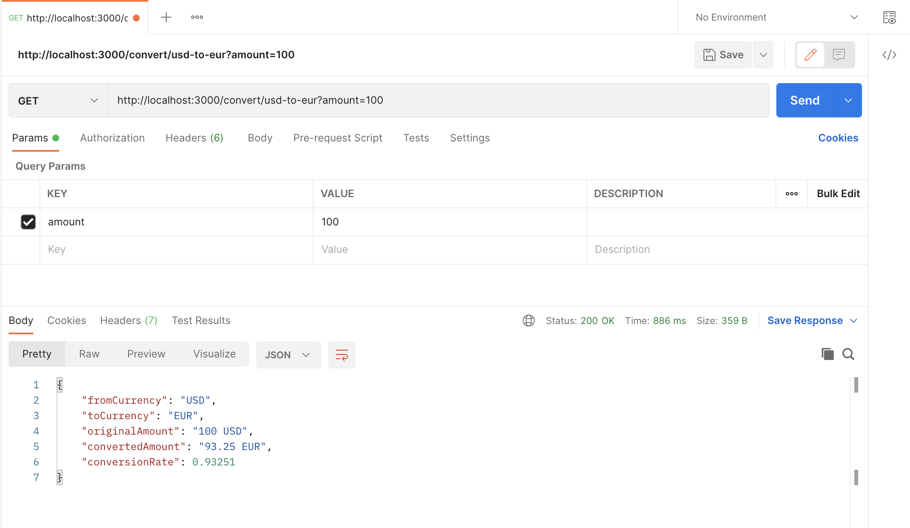
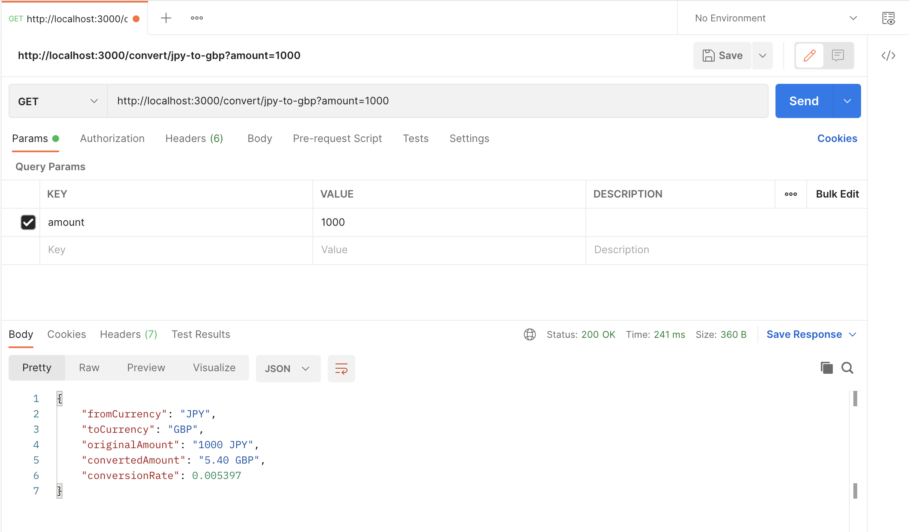

## API Integration with Node.js and Express

In this project, we have created a web server using Node.js and the Express framework to explore and interact with various APIs. Node.js provides a robust and scalable environment for building server-side applications, and Express simplifies the routing and middleware integration, creating a seamless development experience.

### Introduction

Our server is configured to handle various API integrations, providing endpoints that interact with external services to fetch and serve data. We have utilized popular libraries such as `axios` for making HTTP requests and `morgan` for logging HTTP requests details, enhancing the development and debugging process.

Throughout this documentation, we will walk through different tasks, each focusing on interacting with a specific API. We will cover the setup, the code implementation, and provide reflections on the experience of using each API.

Our objective is to demonstrate how to integrate external APIs into a Node.js and Express application, showcase the potential capabilities, and discuss the ease of use and applications of each API.

Let's dive into the tasks and explore the world of APIs!

### Integration of Diverse APIs

This project explores the seamless integration of multiple APIs to deliver a suite of services including weather forecasting, currency exchange, comprehensive country data retrieval, and mapping functionalities.

## Task 1: Weather Data

### Current Weather Data and 5-Day Weather Forecast

We have two endpoints that provide weather information using the OpenWeatherMap API.

```javascript
// Endpoint to get the current weather
app.get('/currentWeather/:city/:country', async (req, res) => {
    try {
        const { city, country } = req.params;
        const url = `https://api.openweathermap.org/data/2.5/weather?q=${city},${country}&units=metric&appid=${apiKey}`;
        const response = await axios.get(url);
        const weatherData = response.data;

        res.json({
            location: `${city}, ${country}`,
            description: weatherData.weather[0].description,
            temperature: `${weatherData.main.temp}°C`,
            feels_like: `${weatherData.main.feels_like}°C`,
            humidity: `${weatherData.main.humidity}%`,
            wind_speed: `${weatherData.wind.speed} m/s`,
            sunrise: new Date(weatherData.sys.sunrise * 1000).toLocaleTimeString(),
            sunset: new Date(weatherData.sys.sunset * 1000).toLocaleTimeString()
        });
    } catch (error) {
        console.error('Error retrieving current weather', error);
        res.status(500).send('Error retrieving current weather');
    }
});
```
```javascript
// Endpoint to get the forecast detail for a specific city
app.get('/forecast/:city/:country', async (req, res) => {
    try {
        const { city, country } = req.params;
        const url = `https://api.openweathermap.org/data/2.5/forecast?q=${city},${country}&units=metric&appid=${apiKey}`;
        const response = await axios.get(url);

        const forecast = response.data.list.map((entry) => ({
            date: new Date(entry.dt * 1000).toLocaleDateString(),
            time: new Date(entry.dt * 1000).toLocaleTimeString(),
            temperature: `${entry.main.temp}°C`,
            feels_like: `${entry.main.feels_like}°C`,
            main: entry.weather[0].main,
            description: entry.weather[0].description,
            wind_speed: `${entry.wind.speed} m/s`,
            humidity: `${entry.main.humidity}%`
        }));

        res.json({
            location: `${city}, ${country}`,
            forecast: forecast
        });
    } catch (error) {
        console.error('Error retrieving 5-day forecast', error);
        res.status(500).send('Error retrieving 5-day forecast');
    }
});
```

### Results and Screenshots

#### Current Weather in London, United Kingdom

Here's the result of retrieving the current weather data for London, United Kingdom:



#### 5-Day Weather Forecast in Tokyo, Japan

And here is the 5-day weather forecast for Tokyo, Japan:



### Reflection:
*Ease of Use:* The OpenWeather API is user-friendly, with comprehensive documentation and code examples in multiple programming languages. For instance, fetching the current weather in a city only requires a simple GET request with the city name and API key as query parameters. This simplicity encourages even novice developers to integrate weather data into their applications.

*Capabilities:* OpenWeather provides not only real-time weather information but also forecast data for up to 7 days, historical weather data for 5 previous days, and weather maps. For example, a developer can easily obtain the temperature, humidity, wind speed, and weather conditions for a city like Tokyo with a single API call.

*Potential Applications:* The applications for OpenWeather are diverse. A travel application could use the 7-day forecast feature to help users pack appropriately for their destinations. Similarly, a smart home system could use real-time weather data to adjust heating or cooling devices for energy efficiency. An agricultural application could use historical weather data to help farmers make informed decisions about planting and harvesting.

## Task 2: Country Information

### Country Information Retrieval

This endpoint retrieves information about a specific country using the RestCountries API.

```javascript
// Endpoint to retrieve information about a specific country
app.get('/country/:countryName', async (req, res) => {
    const { countryName } = req.params;
    try {
        const response = await axios.get(`https://restcountries.com/v3.1/name/${countryName}`);
        const country = response.data[0];
        const countryInfo = {
            countryName: country.name.common, // Adding the common country name
            capitalCity: country.capital ? country.capital[0] : 'Not Available', // Adding the capital city
            population: country.population.toLocaleString(), // Formatting the population for readability
            area: `${country.area.toLocaleString()} km²`, // Adding units to the area
            officialLanguage: country.languages ? Object.values(country.languages).join(', ') : 'Not Available', // Joining all official languages if multiple
            currencies: country.currencies ? Object.values(country.currencies).map(c => c.name).join(', ') : 'Not Available', // Adding currency information
            region: country.region, // Including the region
            subregion: country.subregion ? country.subregion : 'Not Available', // Including the subregion if available
            flag: country.flags.svg ? country.flags.svg : 'Not Available' // Providing the URL to the country's flag
        };
        res.json(countryInfo);
    } catch (error) {
        console.error(`Error retrieving information about ${countryName}:`, error);
        res.status(500).send(`Error retrieving information about ${countryName}`);
    }
});

// Endpoint to retrieve a list of all countries in a specific continent
app.get('/continent/:continentName', async (req, res) => {
    const { continentName } = req.params;
    try {
        const response = await axios.get('https://restcountries.com/v3.1/all');
        const countriesInContinent = response.data
            .filter(country => country.region?.toLowerCase() === continentName.toLowerCase())
            .map(country => ({
                countryName: country.name.common,
                capitalCity: country.capital ? country.capital[0] : 'Not Available',
                population: country.population.toLocaleString(),
                area: country.area ? `${country.area.toLocaleString()} km²` : 'Not Available',
                languages: country.languages ? Object.values(country.languages).join(', ') : 'Not Available',
                flag: country.flags.svg ? country.flags.svg : 'Not Available'
            }));

        res.json({
            continent: continentName.charAt(0).toUpperCase() + continentName.slice(1).toLowerCase(),
            numberOfCountries: countriesInContinent.length,
            countries: countriesInContinent
        });
    } catch (error) {
        console.error(`Error retrieving list of countries in ${continentName}:`, error);
        res.status(500).send(`Error retrieving list of countries in ${continentName}`);
    }
});
```
### Results and Screenshots

#### Retrieve information about Brazil, including its population, area, and official language

Here are the details retrieved for Brazil, including its population, area, and official language:



#### Retrieve a list of all countries in Africa

And here is the list showing all the countries in Africa along with some details:




### Reflection: 
*Ease of Use:* The Currency Converter API is accessible, requiring a simple API key for usage. The documentation is clear, and the API endpoints are designed to be self-explanatory. For example, converting USD to EUR is as easy as sending a GET request to the /convert endpoint with q=USD_EUR as a query parameter.

*Capabilities:* The API supports conversion between multiple currencies and provides real-time conversion rates. A practical example would be converting 100 USD to EUR, which the API processes quickly and returns the current equivalent in EUR based on the latest exchange rates.

*Potential Applications:* The immediate application of this API is for financial services and currency exchange platforms that require real-time data to provide users with accurate conversion rates. It's also beneficial for international e-commerce sites that need to display prices in a local currency or for travelers using a budgeting app to keep track of their expenses in different currencies during international trips.

### Task 3: Map Services
### Google Maps Integration
We have integrated Google Maps to provide map services and route calculations.

### Map Display
To display a map, you can use the following endpoint:

```javascript
app.get('/map', (req, res) => {
    res.sendFile(path.join(__dirname, 'public', 'map.html'));
});

```

```html
<!-- map.html -->
<!DOCTYPE html>
<html>
<head>
    <title>Google Maps: New York City</title>
    <script>
        async function fetchApiKey() {
            const response = await fetch('/api/maps-api-key');
            const data = await response.json();
            return data.apiKey;
        }

        async function initMap() {
            const apiKey = await fetchApiKey();
            const script = document.createElement('script');
            script.src = `https://maps.googleapis.com/maps/api/js?key=${apiKey}&callback=loadMap`;
            script.defer = true;
            document.head.appendChild(script);
        }

        function loadMap() {
            var nyc = {lat: 40.7128, lng: -74.0060};
            var map = new google.maps.Map(document.getElementById('map'), {
                zoom: 12,
                center: nyc
            });
            var marker = new google.maps.Marker({
                position: nyc,
                map: map
            });
        }
    </script>
    <style>
        #map {
            height: 100vh;
            width: 100%;
        }
    </style>
</head>
<body onload="initMap()">
<div id="map"></div>
</body>
</html>

```

### Shortest Route Calculation
To calculate the shortest route between two locations, you can use this endpoint:
```javascript
app.get('/map/shortest-route', (req, res) => {
    res.sendFile(path.join(__dirname, 'public', 'shortest_route.html'));
});

app.get('/api/maps-api-key', (req, res) => {
    res.json({ apiKey: googleMapsApiKey });
});

```

```html
<!-- shortest_route.html -->
<!DOCTYPE html>
<html>
<head>
    <title>Google Maps: Route Finder</title>
    <script>
        async function fetchApiKey() {
            const response = await fetch('/api/maps-api-key');
            const data = await response.json();
            return data.apiKey;
        }

        async function initMap() {
            const apiKey = await fetchApiKey();
            const script = document.createElement('script');
            script.src = `https://maps.googleapis.com/maps/api/js?key=${apiKey}&callback=loadMap&libraries=places`;
            script.defer = true;
            document.head.appendChild(script);
        }

        function loadMap() {
            var sanFrancisco = new google.maps.LatLng(37.7749, -122.4194);
            var losAngeles = new google.maps.LatLng(34.0522, -118.2437);

            var map = new google.maps.Map(document.getElementById('map'), {
                zoom: 6,
                center: sanFrancisco
            });

            var directionsService = new google.maps.DirectionsService();
            var directionsRenderer = new google.maps.DirectionsRenderer();
            directionsRenderer.setMap(map);
            directionsRenderer.setPanel(document.getElementById('directions-panel'));

            var request = {
                origin: sanFrancisco,
                destination: losAngeles,
                travelMode: 'DRIVING'
            };

            directionsService.route(request, function(result, status) {
                if (status == 'OK') {
                    directionsRenderer.setDirections(result);
                }
            });
        }
    </script>
    <style>
        #map {
            height: 50vh;
            width: 100%;
        }
        #directions-panel {
            height: 50vh;
            overflow: auto;
        }
    </style>
</head>
<body onload="initMap()">
<div id="map"></div>
<div id="directions-panel"></div>
</body>
</html>

```

### Results and Screenshots

#### Display a map centered on New York City, USA

Here's the result of displaying a map centered on New York City, USA:



#### Calculation of the shortest route between two locations

And here is the result of finding the shortest route by car between San Francisco, USA, and Los Angeles, USA





### Reflection:
*Ease of Use:* Google Maps API offers a robust set of features that are relatively straightforward to implement for developers with some front-end experience. Acquiring the API key is a simple process, and once obtained, it enables access to a suite of mapping and location services. For example, displaying a map centered on New York City involves just a few lines of code where you specify the coordinates and embed the map into your web application using the Maps JavaScript API.

*Capabilities:* The API's capabilities extend far beyond just displaying maps; they include services for routing, geocoding, distance calculation, and street views. For instance, finding the shortest route by car from San Francisco to Los Angeles can be achieved using the Directions API, which not only provides the route but also step-by-step navigation, estimated time of arrival, and traffic conditions.

*Potential Applications:* The potential applications of the Google Maps API are vast. Real estate platforms can integrate maps to show property locations; logistics companies can optimize delivery routes; travel apps can provide users with point-to-point navigation. An interesting application could be a fitness app that maps out jogging routes for users or a tourism app that offers virtual tours of cities, starting with a view centered on a landmark like the Statue of Liberty when showcasing New York City.

## Task 4: Currency Conversion
### Currency Conversion Services
These endpoints perform currency conversion using the Currency Converter API.

```javascript

// Endpoint to convert an amount from USD to EUR

app.get('/convert/usd-to-eur', async (req, res) => {
    const amountUSD = req.query.amount;
    if (!amountUSD) {
        return res.status(400).send('Please provide an amount to convert.');
    }

    try {
        const response = await axios.get(`https://free.currconv.com/api/v7/convert?q=USD_EUR&compact=ultra&apiKey=${currencyConverterApiKey}`);
        const conversionRate = response.data.USD_EUR;
        const convertedAmount = (amountUSD * conversionRate).toFixed(2);
        res.json({
            fromCurrency: 'USD',
            toCurrency: 'EUR',
            originalAmount: `${amountUSD} USD`,
            convertedAmount: `${convertedAmount} EUR`,
            conversionRate: conversionRate
        });
    } catch (error) {
        console.error('Error converting USD to EUR:', error);
        res.status(500).send('Error converting USD to EUR');
    }
});

```

```javascript
// Endpoint to convert an amount from JPY to GBP
app.get('/convert/jpy-to-gbp', async (req, res) => {
    const amountJPY = req.query.amount;
    if (!amountJPY) {
        return res.status(400).send('Please provide an amount to convert.');
    }

    try {
        const response = await axios.get(`https://free.currconv.com/api/v7/convert?q=JPY_GBP&compact=ultra&apiKey=${currencyConverterApiKey}`);
        const conversionRate = response.data.JPY_GBP;
        const convertedAmount = (amountJPY * conversionRate).toFixed(2);
        res.json({
            fromCurrency: 'JPY',
            toCurrency: 'GBP',
            originalAmount: `${amountJPY} JPY`,
            convertedAmount: `${convertedAmount} GBP`,
            conversionRate: conversionRate
        });
    } catch (error) {
        console.error('Error converting JPY to GBP:', error);
        res.status(500).send('Error converting JPY to GBP');
    }
});

```

### Results and Screenshots

#### Currency Conversion from USD to EUR

Here's the result of converting an amount from USD to EUR



#### Currency Conversion from JPY to GBP

And here is to converting an amount from JPY to GBP:



### Reflection: 
*Ease of Use:* The Currency Converter API is straightforward to use. Signing up for an API key was a hassle-free process. The documentation provided clear instructions and examples of how to make API requests, which was helpful for getting started quickly. The endpoints are RESTful, which means they follow a standard that most developers are familiar with, making it easy to integrate with the API.

*Capabilities:* Although I am using the free tier, which has a limitation of 100 requests per hour, it is quite generous for development and low-traffic applications. The API supports multiple currency conversions, and the response times are quick, which is excellent for real-time applications. The API also provides historical currency data, which can be very useful for analytical applications that need to track and analyze currency fluctuations over time.

*Potential Applications:* The potential applications for this API are vast. It can be used in e-commerce websites to provide real-time currency conversion for international customers, which enhances the user experience. It can also be used in financial applications to help investors make informed decisions by providing the latest exchange rates or historical trends. Furthermore, it can be integrated into travel apps, allowing travelers to convert their expenses into their home currency conveniently.
## Source Code

The source code for this project is available on GitHub:

- [GitHub Repository: cpsc_8710_api_scavenger_hunt](https://github.com/qmohitsingh/cpsc_8710_api_scavenger_hunt)

Feel free to fork the repository, examine the code, and contribute to the development.

## License

This project is made available under the MIT License. This license allows for free use, modification, and distribution, both commercially and privately, with the only requirement being to include the original copyright and license notice in any copy of the project or substantial portions of it.

For more details, see the [LICENSE](https://github.com/qmohitsingh/cpsc_8710_api_scavenger_hunt/blob/main/LICENSE.md) file in the repository.

